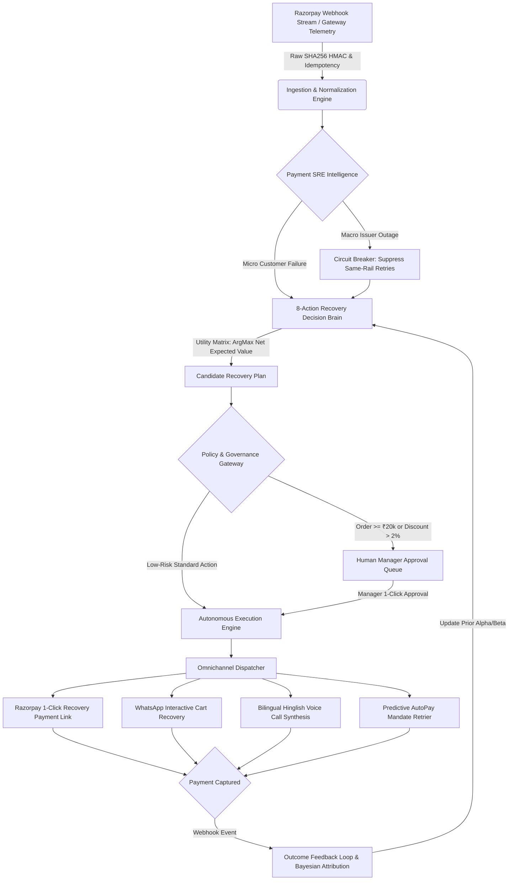

# ⚡ Revive AI — Payment SRE & AI Revenue Recovery Engine
### Razorpay AI Buildathon — Track 03: AI Revenue Recovery
*Find revenue that's slipping away and win it back.*

---

## 🌟 Executive Summary

**Revive AI** is an autonomous, production-grade **Payment SRE Intelligence & AI Revenue Recovery Platform**. It closes the complete loop from real-time payment rail anomaly detection to root-cause diagnosis, expected-net-value recovery planning, bounded omnichannel execution, and continuous Bayesian outcome feedback.

Unlike generic LLM wrappers, **Revive AI** operates as a fail-closed financial decision system built on utility economics, deterministic policy guardrails, and cryptographic webhook idempotency.

---

## 🏛️ Core System Architecture



---

## 🎯 Direct Alignment with Track 03 Problem Statement

| Track 03 Requirement | Revive AI Implementation | Key Feature / Component |
| :--- | :--- | :--- |
| **Payment degradation $\rightarrow$ root cause $\rightarrow$ recovery action** | **Payment SRE Intelligence**: Statistical Z-Score degradation isolation (HDFC UPI success dropped 88% $\rightarrow$ 38%), trips circuit breaker, suppresses same-rail retries, and switches rail to Card/Netbanking links. | `PaymentHealth.jsx`, `IncidentInspector.jsx` |
| **Checkout drop-off recovery** | **Friction Re-engagement**: Detects abandoned checkouts, generates WhatsApp 1-click payment links with dynamic 3% margin-safe discounts. | `WhatsAppSandboxModal.jsx`, `Case CASE-104` |
| **Failed-subscription recovery & Mandate retry sequencer** | **Salary Window Sequencer**: Predicts balance replenishment dates (1st–3rd of month) for SBI AutoPay e-Mandates before retrying. | `CaseTimeline.jsx`, `Cases CASE-401 & 402` |
| **B2B receivables chaser** | **Corporate Invoice Dunning**: Manages aging buckets for ₹85,000 corporate invoices with Virtual Account settlement links. | `CommandCenter.jsx`, `Case CASE-501` |
| **Hinglish voice recovery** | **Audio Voice Sandbox**: Web Speech API speech synthesis with interactive Hindi/English dialogue and SMS/WhatsApp link handoff. | `VoiceCallSandboxModal.jsx` |
| **Promise-to-Pay (PTP) tracker** | **PTP Commitment Tracker**: Interactive commitment calendar that pauses outreach cadence until the promised date and automatically resumes. | `CaseTimeline.jsx` |
| **THE BAR: Measured money recovered across batch** | **2,000-Event Monte Carlo Benchmark**: Seeded PRNG reproducibility demonstrating net recovered revenue (₹65.8 Lakhs / 84.8% rate) vs baseline. | `BatchEvaluator.jsx`, `batchSimulator.js` |
| **THE BAR: Compliant escalation & stopping rules** | **Per-Action Policy Engine & Human Gateway**: High-value order gates ($\ge$ ₹20,000), DND quiet hours (22:00-08:00 IST), max contact ceilings, and Emergency Kill Switch. | `ApprovalCenter.jsx`, `AutonomyPolicy.jsx` |
| **THE BAR: Complete Cryptographic Audit Trail** | **Audit Trail Feed**: Real-time Server-Sent Events (SSE) audit log and raw SHA256 HMAC webhook signature verification. | `apiRoutes.js`, `tests/unit.test.js` |

---

## 🚀 Quickstart & Local Setup

### 1. Installation
```bash
# Clone the repository
git clone https://github.com/aryanchauhan07/Revive-Ai.git
cd Revive-Ai

# Install dependencies
npm install
```

### 2. Run the Full Stack Application
```bash
# Start backend API & webhook server (Port 3001)
npm run server

# In a new terminal, start the Vite frontend (Port 5173)
npm run dev
```

Open **[http://localhost:5173](http://localhost:5173)** in your browser.

### 3. Run Automated Unit Test Suite
```bash
npm test
```
*Executes 6/6 deterministic unit tests (Webhook HMAC verification, Idempotency no-op, Per-action policy engine, Self-recovery action cancellation, Seeded PRNG benchmark reproducibility).*

---

## 🧭 5-Step Guided Demo Journey for Judges

Click the **"Architecture Demo Journey"** button in the top navigation bar to experience the interactive 5-stage walkthrough:
1. **Step 1: Payment SRE Intelligence** — Live HDFC Bank UPI anomaly trigger, Z-score isolation, and circuit breaker trip.
2. **Step 2: Recovery Decision Brain** — 8-Action Economics Matrix computing expected net values:
   $$\mathbb{E}[\text{Net}] = P(\text{Recovery}) \times \text{Amount} - \text{Cost} - \text{Risk Penalty}$$
3. **Step 3: Policy & Governance Gateway** — High-value orders ($\ge$ ₹20k) and discount reviews routed to the Human Manager Approval Queue.
4. **Step 4: Omnichannel Execution** — Interactive Razorpay 1-Click Checkout, WhatsApp Cart Recovery, and Hinglish Voice Call simulations.
5. **Step 5: Outcome Feedback Loop & Batch Benchmark** — Bayesian prior learning update upon payment capture and 2,000-event Monte Carlo ROI verification.

---

## 🛠️ Tech Stack

- **Frontend**: React 18, Vite, Tailwind CSS, Lucide Icons, Canvas Confetti, Web Speech API.
- **Backend**: Node.js, Express, Server-Sent Events (SSE), Crypto (HMAC-SHA256).
- **Simulation**: Seeded Mulberry32 PRNG Monte Carlo Engine (2,000 events).
- **Testing**: Node Native Test Runner (`node:test`, `node:assert`).

---

## 📜 Documentation Reference
- [PLATFORM_PAGE_GUIDE_AND_VIDEO_SCRIPT.md](file:///c:/Users/User/OneDrive/Revive%20AI/PLATFORM_PAGE_GUIDE_AND_VIDEO_SCRIPT.md) — Plain English tab-by-tab guide & timed 5-minute video walkthrough pitch script.
- [SYSTEM_ARCHITECTURE_GUIDE.md](file:///c:/Users/User/OneDrive/Revive%20AI/SYSTEM_ARCHITECTURE_GUIDE.md) — Complete architectural deep dive, mathematical formulas, and policy specifications.
- [PROBLEM_STATEMENT.md](file:///c:/Users/User/OneDrive/Revive%20AI/PROBLEM_STATEMENT.md) — Track 03 problem statement and domain mapping.

---
*Built for the Razorpay AI Buildathon 2026 — Track 03: AI Revenue Recovery*
